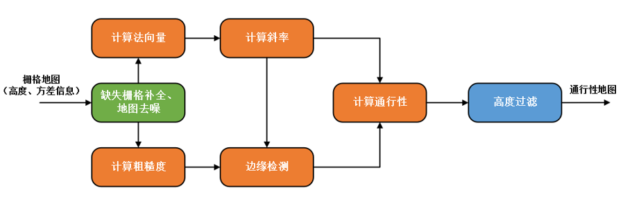

# elevation-mapping

## 介绍
- 四足项目可行性区域检测，根据先验位姿，利用传感器数据稠密建图，为导航规划提供可行性区域的估计
- 具体采用了[四足机器人的ndt定位程序](https://gitee.com/csc105_slam_group/location)获取位姿信息，采用[Realsense D435i相机](https://gitee.com/sensors_and_external_devices_drive/realsense-ros)获取深度点云信息。采用detection节点对接定位信息传送给elevation_mapping节点（这里的elevation_mapping较github版本有修改），在elevation_mapping中根据每个栅格内点的方差大小确定可行与否


## 安装

### 开发环境

ubuntu16.04

ros Kinetic

### 依赖包

- [Grid Map](https://github.com/anybotics/grid_map) (grid map library for mobile robots)
- [kindr](http://github.com/anybotics/kindr) (kinematics and dynamics library for robotics)
- [kindr_ros](https://github.com/anybotics/kindr_ros) (ROS wrapper for kindr)
- [Point Cloud Library (PCL)](http://pointclouds.org/) (point cloud processing)
- [Eigen](http://eigen.tuxfamily.org) (linear algebra library)


### 编译
```
catkin_make
```

## 节点参数含义说明
`./detection/launch/all.launch`包含了设置好的location、detection、elevation_mapping节点，具体节点参数的含义说明如下：

### 1. 节点 detection

接收机器人位姿和每一帧点云数据，进行简单滤波处理，转化成相应坐标系下的数据

#### 订阅的话题名称

* **`/odom`** (nav_msgs::Odometry) 机器人的Odometry，这里是基于`/base_link`的frame
* **`/AreoCameraFront/depth/color/points`** (sensor_msgs::PointCloud2) 相机节点发布的深度点云（无颜色信息）

#### 发布的话题名称
* **`/odom_pose`** (geometry_msgs::PoseWithCovarianceStamped) 发布机器人pose节点，对接elevation_mapping节点需要的格式，基于`/base_link`的frame
* **`/camera_point`** (sensor_msgs::PointCloud2) 直通滤波后的相机点云数据
* **`/odom_pose_cameraframe`** (nav_msgs::Odometry) 发布相机pose节点，基于`cameraFrame`

#### 参数
* **`cameraFrame`** (string) 传感器（相机）frame的id
* **`cameraPoint`** (string) 订阅深度点云数据的话题名称
* **`odomFrame`** (string) 订阅机器人Odometry的话题名称
* **`baseFrame`** (string) 订阅机器人本体frame的id
* **`lidarFrame`** (string) 传感器（雷达）frame的id，涉及坐标转换，与Odometry的frame id保持一致
* **`cameraFrame`** (string) 传感器（相机）frame的id
* **`FilterFieldName`** (string) 对相机点云进行直通滤波的通道名称，可选x y z
* **`setFilterLimitsUp`** (double) 直通滤波上界（单位：m）
* **`setFilterLimitsDown`** (double) 直通滤波下界（单位：m）
* **`use_static_tf`** (bool) 为true时，采用固定的相机和lidarFrame的坐标转换关系（程序内置矩阵，可通过预先标定得到）

### 2. 节点rawmapping

接收处理后的每一帧点云数据，融合成局部点云地图，并作直通滤波、高度滤波、体素滤波、离群点去除、限制发布地图点的数量

#### 订阅的话题名称
* **`/camera_point`** (sensor_msgs::PointCloud2) 直通滤波后的相机点云数据
* **`/odom_pose_cameraframe`** (nav_msgs::Odometry) 发布相机pose节点，基于`cameraFrame`

#### 发布的话题名称
* **`/rawmap`** (sensor_msgs::PointCloud2) 发布原始地图（滤波前，仅作融合）
* **`/fusemap`** (sensor_msgs::PointCloud2) 发布滤波处理后的带颜色地图

#### 参数
* **`cameraFrame`** (string) 传感器（相机）frame的id
* **`mapFrame`** (string) 地图发布时的frame
* **`cameraPoint`** (string) 订阅深度点云数据的话题名称
* **`FilterFieldName`** (string) 对相机点云进行直通滤波的通道名称，可选x y z
* **`setFilterLimitsUp`** (double) 直通滤波上界（单位：m）
* **`setFilterLimitsDown`** (double) 直通滤波下界（单位：m）
* **`setFilterheight`** (double) 高度阈值
* **`setFilterLimitsUp`** (bool) 是否进行离群点去除
* **`setOutlierFilterMeanK`** (int) k近邻点数
* **`setOutlierFilterThresh`** (double) 离群点阈值
* **`voxelsize`** (float) 体素滤波方格大小（单位：m）
* **`setPointNumLimit`** (double) 限制地图中点的数量

### 3. 节点 elevation_mapping

获取每一帧点云数据，结合机器人实时位姿，发布栅格地图


#### 发布的话题名称
* **`/elevation_mapping/elevation_map`** (grid_map_msgs/GridMap) 以GridMap显示栅格地图（在rviz中调整
`Color Transformer`为`ColorLayer`，调整`Color Layer`为`height_color`得到可行区域的可视化显示）
* **`/elevation_map_raw_visualization/elevation_cloud`** (sensor_msgs/PointCloud2)以点云形式显示栅格地图

#### 订阅话题参数
* **`point_cloud_topic`** (string) 相机深度点云信息，格式为`sensor_msgs/PointCloud2`
* **`robot_pose_with_covariance_topic`** (string) 机器人位姿（不是相机位姿）,格式为`geometry_msgs/PoseWithCovarianceStamped`
* **`tf`** (string) 坐标变化关系，默认为`/tf`，不需要设置，格式为`tf/tfMessage`
* **`base_frame_id`** (string) 机器人frame的id
* **`map_frame_id`** (string) 地图frame的id
* **`sensor_frame_id`** (string) 传感器（相机）frame的id

#### 重要参数
* **`length_in_x` `length_in_y`** (double) 地图的长宽大小（单位：m）
* **`resolution`** (double) 地图的分辨率（单位：cm）
* **`threshold`** (double) 可行性区域不确定度阈值
* **`max_variance`** (double) 建立栅格的方差最大值
* **`robot_pose_cache_size`** (int) 位姿数据缓存的大小，越大则占用内存越高，根据位姿缓存匹配最近时间戳的传感器数据
* **`min_update_rate`** (double) 最小更新速率，一般设置为0.1即可
* **`fused_map_publishing_rate`** (double) 地图发布速率，对实时性影响较大，要考虑到pose和传感器数据的发布速率，一般设置为3.0

#### 可选参数
* **`sensor_processor/apply_voxelgrid_filter`** (bool) 进行体素滤波，提升实时性，但会导致准确性降低
* **`sensor_processor/voxelgrid_filter_size`** (double) 体素滤波方格大小（单位：cm）

* **`enable_visibility_cleanup`** (bool) 进行可视化清理，会影响实时性
* **`visibility_cleanup_rate`** (double) 可视化清理更新速率，会影响实时性
* **`scanning_duration`** (double) 可视化清理扫描速率，会影响实时性

* **`sensor_processor/type`** (string) 传感器类型，这里设置为`structured_light`
* **`sensor_processor/cutoff_max_depth`** (double) 传感器输入最大深度值（单位：m）
* **`sensor_processor/cutoff_min_depth`** (double) 传感器输入最小深度值（单位：m）
* **`sensor_processor/normal_factor_a` `sensor_processor/normal_factor_b` `sensor_processor/normal_factor_c` `sensor_processor/normal_factor_d` `sensor_processor/normal_factor_e` `sensor_processor/lateral_factor`** (double) 结构光传感器内参

### 4. 节点 grid_map_test

获取点云地图（融合后），发布grid_map

#### 订阅的话题名称
* **`point_sub_topic`** (sensor_msgs::PointCloud2) 订阅点云地图（融合后）

#### 发布的话题名称
* **`grid_pub_topic`** (grid_map_msgs::GridMap) 发布栅格地图

#### 参数
* **`point_sub_topic`** (string) 订阅点云地图的话题名称
* **`grid_pub_topic`** (string) 发布栅格地图的话题名称
* **`grid_frame_id`** (string) 发布栅格地图所属的frame（一般与点云地图的frame保持一直）
* **`grid_map_size_x`** (float) 栅格地图尺寸x（单位：m）
* **`grid_map_size_y`** (float) 栅格地图尺寸y（单位：m）
* **`grid_map_position_x`** (float) 栅格地图起始中心点位置x（单位：m）
* **`grid_map_position_y`** (float) 栅格地图起始中心点位置y（单位：m）
（可以使用命令`roslaunch grid_map_demos move_demo.launch`查看地图随中心点移动的效果）
* **`grid_map_resolution`** (float)  栅格地图分辨率（边长，单位：m）

### 5. 节点 filters_demo（属于grid_map库下的grid_map_demos包）

根据栅格地图，进行滤波，输出通行性地图



#### 订阅的话题名称
* **`input_topic`** (grid_map_msgs::GridMap) 订阅栅格地图（默认图层为elevation）

#### 发布的话题名称
* **`output_topic`** (grid_map_msgs::GridMap) 发布通行性栅格地图

#### 参数

修改`./detection/config/filters_demo_filter_chain.yaml`

## 效果图


